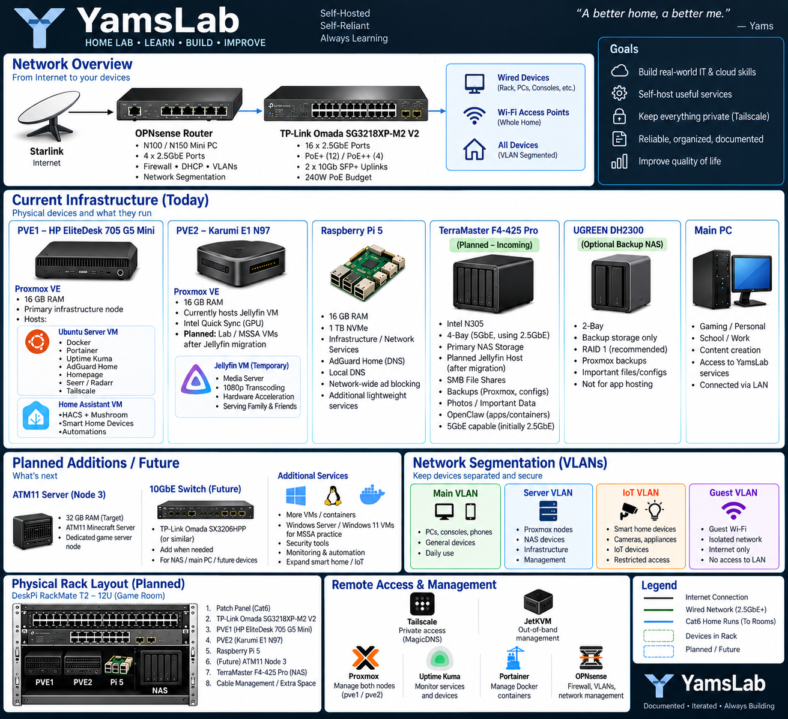

# 🖥️ YamsLab Homelab

Welcome to **YamsLab**, my personal homelab built to develop hands-on experience with networking, virtualization, Linux, containers, infrastructure, and cloud technologies.

I am currently completing the **Microsoft Software & Systems Academy (MSSA) Server & Cloud Administration** program while building YamsLab as a practical environment for applying the concepts I learn.

> 🚧 **YamsLab is an active project.** The environment is continuously being expanded, documented, and improved.

---

## 🔗 Quick Links

| Section | Description |
| --- | --- |
| 🌐 [Networking Documentation](networking/README.md) | Network configuration and documentation |
| 🗺️ [Network Architecture](#-yamslab-network-architecture) | Current and planned YamsLab topology |
| 🖥️ [Current Infrastructure](#-current-infrastructure) | Hardware, nodes, and services |
| 🐳 [Services & Technologies](#-services--technologies) | Services and platforms used throughout YamsLab |
| 🔧 [Current Projects](#-current-projects) | Projects currently running or in development |
| 🛠️ [Troubleshooting Case Studies](#️-troubleshooting-case-studies) | Real troubleshooting scenarios and solutions |
| 🧠 [Skills Demonstrated](#-skills-demonstrated) | Technical skills demonstrated through YamsLab |

---

## 🌐 YamsLab Network Architecture

---

## 🎯 Project Goals

YamsLab started as a way to gain hands-on experience beyond classroom training, but it has also grown into a project focused on making the technology in my home more reliable, secure, and convenient.

My goals include:

- Building and administering a multi-node server environment
- Learning network design and troubleshooting
- Managing Linux servers
- Deploying and managing virtual machines
- Working with Docker containers
- Implementing monitoring and infrastructure services
- Configuring secure remote access
- Learning DNS, DHCP, routing, firewalls, and VLANs
- Building centralized storage and backup infrastructure
- Improving reliability and organization of my home network
- Documenting technical projects and troubleshooting

---

## 🖥️ Current Infrastructure

### PVE1 — HP EliteDesk 705 G5 Mini

**Role:** Primary stable infrastructure node

- Proxmox VE
- 16 GB DDR4 RAM
- Hosts multiple virtualized infrastructure workloads

#### Ubuntu Server VM

Runs Docker and containerized services including:

- Docker
- Portainer
- Uptime Kuma
- AdGuard Home
- Homepage
- Seerr
- Radarr
- Tailscale

#### Home Assistant VM

Dedicated Home Assistant environment used for:

- Smart-home integrations
- HACS
- Mushroom dashboard
- Device automation
- Home infrastructure monitoring

---

### PVE2 — Karumi E1 N97 Mini PC

**Role:** Secondary Proxmox / lab node

- Proxmox VE
- 16 GB DDR4 RAM
- 256 GB NVMe
- Currently hosts the Jellyfin VM
- Intel Quick Sync hardware acceleration

#### Jellyfin VM

Current media-server workload:

- Jellyfin Media Server
- Intel Quick Sync hardware acceleration
- 1080p transcoding
- Remote family access through Tailscale
- SMB-based media storage

Jellyfin is planned to migrate to the TerraMaster F4-425 Pro NAS.

After the migration, PVE2 will be repurposed for:

- MSSA lab environments
- Windows Server VMs
- Windows client VMs
- Linux VMs
- Networking labs
- Additional services
- Testing and experimentation

---

### Raspberry Pi 5

**Role:** Lightweight infrastructure platform

- 16 GB RAM
- 1 TB NVMe
- Planned primary DNS / AdGuard Home host
- Network-wide DNS filtering
- Secondary infrastructure services
- Lightweight network tools

The Pi provides a low-power platform for services that do not require a full Proxmox host.

---

### TerraMaster F4-425 Pro — Planned Primary NAS

**Role:** Primary centralized storage and future Jellyfin host

- Intel N305
- 4-bay NAS
- 5GbE capable
- Initially connected to YamsLab at 2.5GbE
- Centralized storage
- SMB file shares
- Planned Jellyfin host
- Application and configuration storage
- Important file storage
- Proxmox backup storage

Planned migration:

**PVE2 Jellyfin VM → TerraMaster F4-425 Pro**

Moving Jellyfin to the NAS will free PVE2 for virtualization, lab environments, and additional infrastructure workloads.

---

### UGREEN DH2300 — Optional Backup NAS

**Role:** Secondary / backup storage

- 2-bay NAS
- Selective backup target
- Proxmox VM and configuration backups
- Important personal files
- Home Assistant backups
- Docker/application configuration backups
- Important TerraMaster data
- Not intended to be a primary application server

The backup NAS will prioritize irreplaceable data rather than duplicating the entire media library.

---

### Main PC

**Role:** Primary workstation

Used for:

- Gaming
- Personal use
- MSSA coursework
- YamsLab administration
- Remote server management
- Accessing lab services

---

## 🐳 Services & Technologies

| Technology | Purpose |
| --- | --- |
| Proxmox VE | Virtualization and VM management |
| Ubuntu Server | Linux server environment |
| Docker | Containerized services |
| Portainer | Docker container management |
| Uptime Kuma | Service and infrastructure monitoring |
| AdGuard Home | DNS filtering and network-wide ad blocking |
| Tailscale | Secure private remote connectivity |
| Jellyfin | Self-hosted media server |
| Seerr | Media request management |
| Radarr | Movie management |
| Homepage | Infrastructure dashboard |
| Home Assistant | Smart-home management and automation |
| SMB | Network file sharing |

---

## 🌐 Networking

The current YamsLab network uses **Starlink** for internet connectivity with private LAN addressing and Tailscale for secure remote access.

Networking concepts being implemented and practiced include:

- Static IP addressing
- DNS
- DHCP
- TCP/IP
- LAN/WAN networking
- VPN and remote access
- Network troubleshooting
- Service monitoring
- Managed switching
- VLAN segmentation
- Structured Ethernet cabling

### Planned Network Upgrade

The planned network architecture is:

**Internet → OPNsense → Managed 2.5GbE Switch → YamsLab + House Network**

Planned infrastructure includes:

- Dedicated OPNsense firewall/router
- TP-Link Omada SG3218XP-M2 V2 managed switch
- 16 × 2.5GbE Ethernet ports
- PoE+ / PoE++ support
- 10Gb SFP+ uplinks
- Cat6 structured cabling
- Central patch panel
- PoE wireless access points
- VLAN segmentation
- UPS battery backup

The goal is to move routing, DHCP, firewalling, and network segmentation away from the ISP router and into infrastructure that I directly manage.

---

## 🔐 Planned VLANs

| VLAN | Purpose |
| --- | --- |
| Main | PCs, consoles, phones, and trusted devices |
| Server | Proxmox nodes, VMs, NAS devices, containers, and infrastructure |
| IoT | Smart-home devices, appliances, cameras, and other IoT devices |
| Guest | Isolated guest Wi-Fi with internet-only access |

Firewall rules between VLANs will be used to restrict unnecessary communication while allowing required services.

---

## 🗄️ Planned Rack Infrastructure

YamsLab is being consolidated into a **DeskPi RackMate T2 12U rack** located in the game room.

Planned rack equipment includes:

- Cat6 patch panel
- TP-Link Omada SG3218XP-M2 V2
- PVE1 — HP EliteDesk 705 G5 Mini
- PVE2 — Karumi E1 N97
- Raspberry Pi 5
- TerraMaster F4-425 Pro
- Future ATM11 server
- Rack status display
- Cable management
- Remote KVM management

An APC UPS will provide battery backup and power protection for critical YamsLab infrastructure.

---

## 🎮 Future Node 3 — ATM11 Server

A dedicated third server is planned for game-server workloads.

Primary planned workload:

**All the Mods 11 (ATM11) Minecraft Server**

Target configuration:

- 32 GB RAM
- Dedicated game-server role
- Connected to the YamsLab server network
- Monitored alongside other infrastructure

Keeping this workload on a dedicated system prevents a heavily modded Minecraft server from competing with core infrastructure services.

---

## 🔒 Remote Access & Management

YamsLab is designed around private remote access rather than exposing internal services directly to the public internet.

### Tailscale

Used for:

- Secure remote access
- Private service connectivity
- MagicDNS
- Family access to Jellyfin
- Remote YamsLab administration

### JetKVM

Planned for out-of-band management of rack hardware.

This provides remote access to:

- Display output
- Keyboard and mouse input
- System recovery
- BIOS / boot environments

### Proxmox

Provides centralized management for:

- PVE1
- PVE2
- Virtual machines
- Lab environments

### Portainer

Provides management and visibility for Docker containers.

### Uptime Kuma

Monitors YamsLab services and infrastructure availability.

---

## 🔧 Current Projects

### ✅ Completed / Operational

- Proxmox multi-node environment
- Ubuntu Server deployment
- Docker environment
- Portainer container management
- Uptime Kuma monitoring
- AdGuard Home DNS filtering
- Tailscale remote connectivity
- Jellyfin media server
- Intel Quick Sync hardware acceleration
- Homepage infrastructure dashboard
- Seerr and Radarr integration
- SMB network shares
- Home Assistant VM

### 🚧 In Progress / Planned

- TerraMaster F4-425 Pro deployment
- Jellyfin migration from PVE2 to NAS
- Centralized NAS storage
- Proxmox backup infrastructure
- OPNsense firewall deployment
- TP-Link Omada managed 2.5GbE network
- VLAN segmentation
- Whole-home Cat6 Ethernet drops
- Centralized patch panel
- DeskPi RackMate T2 12U deployment
- PoE wireless access points
- Dedicated Node 3
- All the Mods 11 Minecraft server
- UPS protection
- Rack monitoring display
- Remote KVM management
- Improved network documentation

---

## 🛠️ Troubleshooting Case Studies

YamsLab documentation includes real issues encountered while building and maintaining the environment.

These case studies focus on:

- The original problem
- Troubleshooting process
- Commands and tools used
- Root cause
- Final solution
- Lessons learned

### 🎬 Jellyfin VM Migration & Connectivity Troubleshooting

[Jellyfin VM Migration & Connectivity Troubleshooting](troubleshooting/jellyfin-vm-migration.md)

Migrated Jellyfin into a dedicated Proxmox VM and troubleshot issues involving:

- Network connectivity
- Docker networking
- Storage mounts
- Firewall configuration
- Intel Quick Sync hardware acceleration

Additional troubleshooting case studies will be added as YamsLab continues to grow.

---

## 🧠 Skills Demonstrated

YamsLab provides hands-on experience with:

`Networking` • `TCP/IP` • `DNS` • `DHCP` • `Linux` • `Proxmox` • `Virtualization` • `Docker` • `Firewalls` • `VPNs` • `VLANs` • `Network Monitoring` • `Storage` • `SMB` • `Troubleshooting` • `Server Administration` • `Infrastructure Documentation`

---

## 📚 Documentation

As YamsLab grows, this repository will contain documentation covering:

- Network architecture
- Network diagrams
- VLAN design
- Firewall configuration
- Server architecture
- Proxmox configuration
- Docker services
- Monitoring
- Storage and backups
- Home infrastructure
- Troubleshooting scenarios
- Lessons learned

The goal is not only to build the environment, but also to document **how it works, why design decisions were made, and how problems were solved.**

---

## 🔐 Security Notice

Sensitive information such as passwords, API keys, authentication tokens, public IP addresses, internal IP addresses, and other credentials are intentionally excluded from this repository.

Public diagrams and screenshots are sanitized before being uploaded.

---

## 🚀 Future Direction

YamsLab will continue evolving alongside my training in server, networking, and cloud administration.

The long-term goal is to create a reliable, segmented, monitored, backed-up, and well-documented environment that demonstrates practical infrastructure administration and troubleshooting skills.

As new technologies are introduced, YamsLab will continue serving as a hands-on environment for testing, learning, troubleshooting, and documenting real-world infrastructure concepts.
