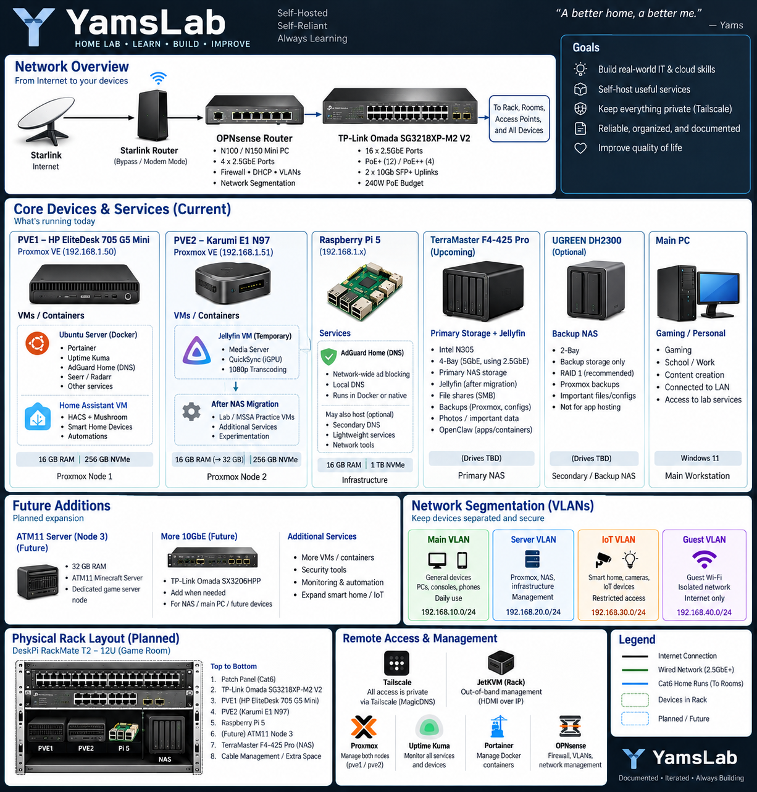

# 🖥️ YamsLab Homelab

Welcome to **YamsLab**, my personal homelab built to develop hands-on experience with networking, virtualization, Linux, containers, infrastructure, and cloud technologies.
## 🔗 Quick Links

- 🌐 [Networking Documentation](networking/README.md)
- 🛠️ [Troubleshooting Case Studies](troubleshooting/)
- 🗺️ [Network Architecture](#-yamslab-network-architecture)
- 🖥️ [Current Infrastructure](#️-current-infrastructure)
- 🔧 [Current Projects](#-current-projects)
- 🧠 [Skills Demonstrated](#-skills-demonstrated)

---

I am currently completing the **Microsoft Software & Systems Academy (MSSA) Server & Cloud Administration** program while building YamsLab as a practical environment for applying the concepts I learn.

> 🚧 **YamsLab is an active project.** The environment is continuously being expanded, documented, and improved.

## 🌐 YamsLab Network Architecture

---

## 🎯 Project Goals

YamsLab was created to provide hands-on experience beyond classroom training.

My goals include:

- Building and administering a multi-node server environment
- Learning network design and troubleshooting
- Managing Linux servers
- Deploying and managing virtual machines
- Working with Docker containers
- Implementing monitoring and infrastructure services
- Configuring secure remote access
- Learning DNS, DHCP, routing, firewalls, and VLANs
- Building centralized storage and backup infrastructure
- Documenting technical projects and troubleshooting

---

## 🖥️ Current Infrastructure

### PVE1 — Primary Proxmox Node
- HP EliteDesk 705 G5 Mini
- Proxmox VE
- Hosts virtual machines and infrastructure workloads

### PVE2 — Secondary Proxmox Node
- Proxmox VE
- Hosts the Jellyfin virtual machine
- Part of the YamsLab Proxmox environment

### Node 1 — Docker Services
Runs containerized infrastructure and application services including:

- Docker
- Portainer
- Uptime Kuma
- AdGuard Home
- Homepage
- Seerr
- Radarr
- Tailscale

### Node 2 — Media Server
- Jellyfin
- Dedicated media-server role
- Remote access through Tailscale

### Raspberry Pi 5
- 16 GB RAM
- Infrastructure platform
- Planned for additional network/infrastructure services

---

## 🐳 Services & Technologies

| Technology | Purpose |
|---|---|
| Proxmox VE | Virtualization and VM management |
| Ubuntu Server | Linux server environment |
| Docker | Containerized services |
| Portainer | Docker management |
| Uptime Kuma | Service and infrastructure monitoring |
| AdGuard Home | DNS filtering |
| Tailscale | Secure remote connectivity |
| Jellyfin | Self-hosted media server |
| Seerr | Media request management |
| Radarr | Media management |
| Homepage | Infrastructure dashboard |

---

## 🌐 Networking

The current YamsLab network uses Starlink connectivity with private LAN addressing and Tailscale for secure remote access.

Networking concepts being implemented and practiced include:

- Static IP addressing
- DNS
- DHCP
- LAN/WAN networking
- VPN and remote access
- Network troubleshooting
- Service monitoring

### Planned Network Upgrade

The next major networking phase will introduce:

**Internet → OPNsense → Managed 2.5GbE Switch → YamsLab + House Network**

Planned additions include:

- Dedicated OPNsense firewall/router
- Managed 2.5GbE switching
- 10Gb SFP+ uplinks
- Cat6 structured cabling
- Central patch panel
- PoE wireless access points
- VLAN segmentation
- UPS battery backup

### Planned VLANs

| VLAN | Purpose |
|---|---|
| Main | PCs, consoles, and trusted devices |
| Server | Proxmox, VMs, containers, and infrastructure |
| IoT | Smart-home and IoT devices |
| Guest | Isolated guest network |

---

## 🔧 Current Projects

### ✅ Completed / Operational

- Proxmox virtualization environment
- Ubuntu Server deployment
- Docker environment
- Portainer container management
- Uptime Kuma monitoring
- AdGuard Home DNS filtering
- Tailscale remote connectivity
- Jellyfin media server
- Homepage infrastructure dashboard
- Seerr and Radarr integration
- SMB network shares

### 🚧 In Progress / Planned

- OPNsense firewall deployment
- Managed 2.5GbE network
- VLAN segmentation
- Whole-home Cat6 Ethernet drops
- Centralized patch panel
- Dedicated Node 3
- Minecraft / All the Mods 11 server
- Central NAS storage
- Proxmox backup infrastructure
- UPS protection
- Improved network documentation

---

## 🧠 Skills Demonstrated

YamsLab provides practical experience with:

`Networking` • `TCP/IP` • `DNS` • `DHCP` • `Linux` • `Proxmox` • `Virtualization` • `Docker` • `Firewalls` • `VPNs` • `Network Monitoring` • `Troubleshooting` • `Server Administration`

---

## 📚 Documentation

As YamsLab grows, this repository will contain documentation covering:

- Network diagrams
- VLAN design
- Firewall configuration
- Server architecture
- Proxmox configuration
- Docker services
- Monitoring
- Storage and backups
- Troubleshooting scenarios
- Lessons learned

---

## 🔐 Security Notice

Sensitive information such as passwords, API keys, authentication tokens, public IP addresses, and other credentials are intentionally excluded from this repository.

---

## 🚀 Future Direction

YamsLab will continue evolving alongside my training in server, networking, and cloud administration.

The long-term goal is to create a reliable, segmented, monitored, and documented environment that demonstrates practical infrastructure administration and troubleshooting skills.
