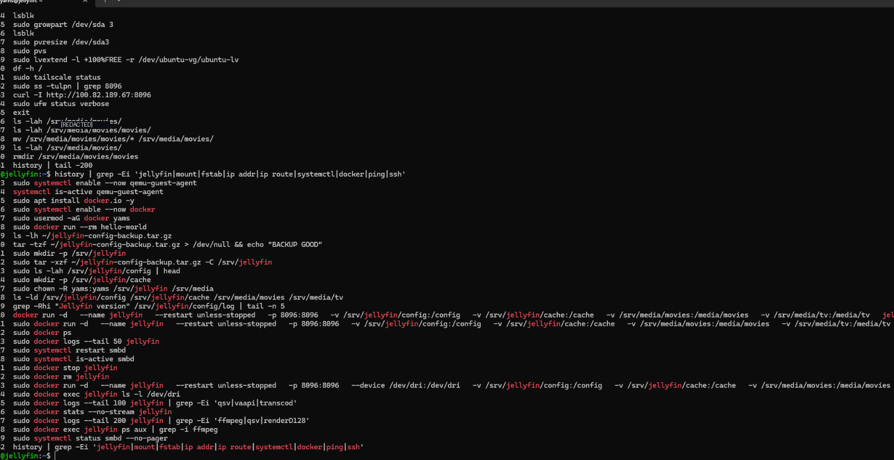

# 🎬 Jellyfin VM Migration & Connectivity Troubleshooting

## What Happened

After migrating Jellyfin into its dedicated VM, I ran into connectivity issues where the service was running but wasn't consistently accessible from other devices on my network.

Instead of immediately rebuilding the service, I worked through the problem from the container outward: checking Jellyfin itself, the listening port, network connectivity, firewall configuration, storage mounts, and finally the container configuration.

---

## Troubleshooting

I first verified that the Jellyfin container was actually running:

```bash
sudo docker ps
```

I then checked Jellyfin's recent logs for startup or service errors:

```bash
sudo docker logs --tail 50 jellyfin
```

Since Jellyfin uses TCP port `8096`, I verified that the VM was actually listening on that port:

```bash
sudo ss -tulpn | grep 8096
```

I also tested the Jellyfin web service directly.

> IP addresses have been intentionally redacted from this documentation.

```bash
curl -I http://<REDACTED-IP>:8096
```

Because the service could potentially have been blocked at the VM level, I checked the Ubuntu firewall configuration:

```bash
sudo ufw status verbose
```

### 📸 Actual CLI Troubleshooting History

Below is a sanitized screenshot of the actual command history I used while migrating and troubleshooting Jellyfin. Network addresses have been redacted before publication.



The command history shows several of the checks and configuration changes performed during the migration, including Docker container verification, port testing, firewall checks, Jellyfin log inspection, storage configuration, and hardware acceleration verification.

---

## Verifying the Migration

The existing Jellyfin configuration had been backed up before the migration. I verified the backup archive before restoring it:

```bash
tar -tzf ~/jellyfin-config-backup.tar.gz > /dev/null && echo "BACKUP GOOD"
```

I then prepared the Jellyfin directories and restored the configuration:

```bash
sudo mkdir -p /srv/jellyfin

sudo tar -xzf ~/jellyfin-config-backup.tar.gz -C /srv/jellyfin

sudo mkdir -p /srv/jellyfin/cache

sudo chown -R yams:yams /srv/jellyfin /srv/media
```

I verified that the restored configuration and media directories were present:

```bash
ls -lah /srv/jellyfin/config | head

ls -ld /srv/jellyfin/config /srv/jellyfin/cache /srv/media/movies /srv/media/tv
```

---

## Recreating the Jellyfin Container

After verifying the directories, I recreated Jellyfin with persistent configuration, cache, movie, and TV mounts:

```bash
sudo docker run -d \
  --name jellyfin \
  --restart unless-stopped \
  -p 8096:8096 \
  -v /srv/jellyfin/config:/config \
  -v /srv/jellyfin/cache:/cache \
  -v /srv/media/movies:/media/movies \
  -v /srv/media/tv:/media/tv \
  jellyfin/jellyfin:10.11.11
```

I then confirmed the container was running:

```bash
sudo docker ps
```

---

## Intel Quick Sync Verification

Once Jellyfin was working again, I recreated the container with access to the VM's `/dev/dri` device so Jellyfin could use hardware acceleration:

```bash
sudo docker stop jellyfin

sudo docker rm jellyfin

sudo docker run -d \
  --name jellyfin \
  --restart unless-stopped \
  -p 8096:8096 \
  --device /dev/dri:/dev/dri \
  -v /srv/jellyfin/config:/config \
  -v /srv/jellyfin/cache:/cache \
  -v /srv/media/movies:/media/movies \
  -v /srv/media/tv:/media/tv \
  jellyfin/jellyfin:10.11.11
```

Rather than assuming hardware acceleration was working, I verified that the GPU device was visible inside the container:

```bash
sudo docker exec jellyfin ls -l /dev/dri
```

I also checked Jellyfin's logs for FFmpeg, QSV, and GPU render activity:

```bash
sudo docker logs --tail 100 jellyfin | grep -Ei 'ffmpeg|qsv|renderD128'
```

I checked the active Jellyfin processes for FFmpeg activity:

```bash
sudo docker exec jellyfin ps aux | grep -i ffmpeg
```

---

## Result

Jellyfin was successfully restored inside its dedicated VM with its existing configuration and media directories intact.

Port `8096` was reachable again, and the container was configured with access to `/dev/dri` for Intel Quick Sync hardware-accelerated transcoding.

---

## What I Took Away From It

This troubleshooting process reinforced that a running Docker container does not necessarily mean the entire service is working correctly.

I had to check each layer separately:

- Docker container status
- Application logs
- Listening ports
- Firewall configuration
- Network connectivity
- Persistent storage mounts
- File permissions
- GPU device access
- Hardware transcoding activity

It also reinforced why backing up application configuration before a migration matters. Because the Jellyfin configuration was preserved, I was able to restore the existing setup instead of rebuilding the server from scratch.

---

### 🔒 Security Note

Internal network information, including IP addresses, has been intentionally redacted from this documentation before publication.

### Security Note

Internal network information, including IP addresses, has been intentionally redacted from this documentation before publication.
